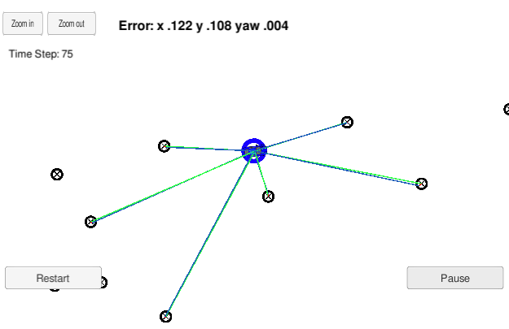

# Localization

### Project Introduction
The goal of this project is try to localize a vehicle that has been kidnapped and taken into a new location. Luckily, it has a map of this location, a (noisy) GPS estimate of its initial location, and lots of (noisy) sensor and control data.

In this project I implement a 2 dimensional particle filter in C++. The particle filter will be given a map and some initial localization information (analogous to what a GPS would provide). At each time step the filter will also get observation and control data.

### Implementation of the Particle Filter

The particle filter follows the following steps:

#### Initialization

The filter is initialized with GPS position estimate sampling from a Gaussian distribution, taking into account Gaussian sensor noise around the initial GPS position and heading estimates.

#### Prediction Step

In the prediction step, each particle position and orientation is estimated from the motion model and current yaw rate and velocity.

Additive Gaussian sensor noise is also taken into account when predicting the new position estimates.

#### Update Step

During the update step, each particle's weight is updated based on LIDAR and RADAR readings of landmarks.

An important step here is to associate each received measurement from the sensors with a landmark from the map. This is done by taking the nearest neighbor (nearest landmark) for each measurement.

#### Resample

In this final step, the particles are resampled from a discrete distribution where each particle has the weight calculated in the update step as the probability to be resampled (to survive and continue to the next time step).

### More information about Particle Filters

* http://robots.stanford.edu/papers/thrun.pf-in-robotics-uai02.pdf
* https://medium.com/@jonathan_hui/tracking-a-self-driving-car-with-particle-filter-ef61f622a3e9
